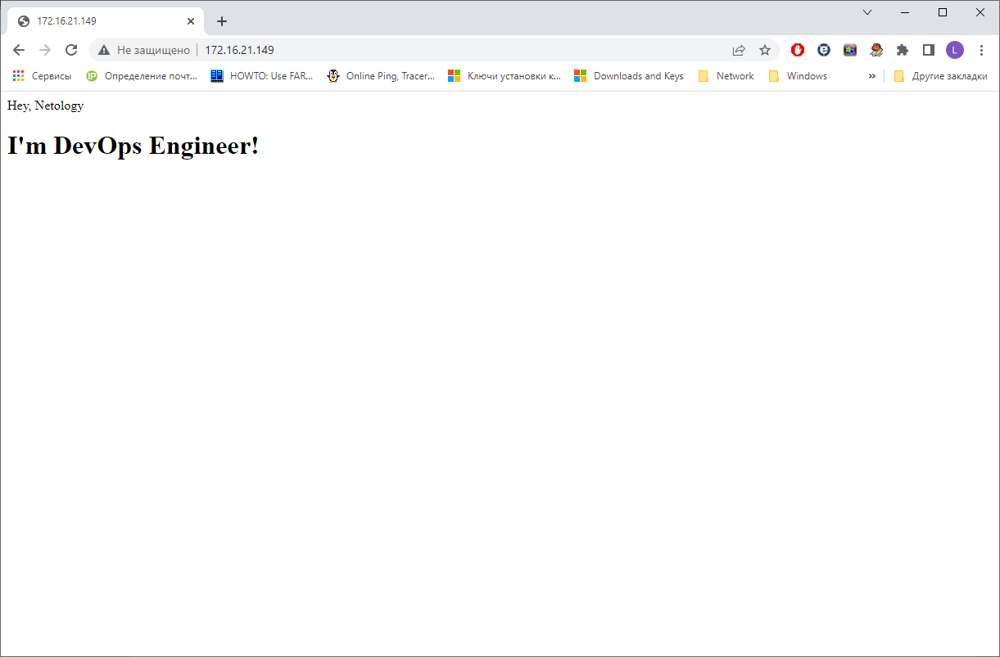

# Домашнее задание к занятию "5.3. Введение. Экосистема. Архитектура. Жизненный цикл Docker контейнера."


## Задача 1
https://hub.docker.com/r/lexche/alpine-nginx



## Задача 2
Высоконагруженное монолитное java веб-приложение
Физический сервер. Монолитное, селдовательно в микросерверах не реализуемо без изменения кода, а высоконагруженность создаёт необходимость в физическом доступе к ресурсами, без использования гипервизора виртуалки.

Nodejs веб-приложение
Это веб приложение, достаточно докера.

Мобильное приложение c версиями для Android и iOS
Виртаулизация - приложение в докере не имеет GUI, соответственно не наш вариант.

Шина данных на базе Apache Kafka
Можно использовать контейнеризацию, если есть финансовые ограничения или тестовая среда, если финансовая нагрузка некритична, то виртуализация.

Elasticsearch кластер для реализации логирования продуктивного веб-приложения - три ноды elasticsearch, два logstash и две ноды kibana
Для указанных продуктов есть контейнеры на dockerhub, так что возможен вариант с контейнеризацией, но если необходима большая отказоустойчивость, то сам Elasticsearvh лучше на виртуальную машину, отказоустойчивость решается на уровне кластера, kibana и logstash так же на виртуалках.

Мониторинг-стек на базе Prometheus и Grafana
Контейнеризация. Из плюсов: скорость развёртывания, масштабируемость.

MongoDB, как основное хранилище данных для java-приложения
Виртуализация, так как речь идёт о хранилище данных, так же возможно использовать физический сервер, но это, на мой взгляд, более расточительно.

Gitlab сервер для реализации CI/CD процессов и приватный (закрытый) Docker Registry
Физический сервер или виртуализация, зависит от объёмов и динамики заполнения жёстких дисков, если есть понимание, что в обозримом времени мощностей физического сервера будет не хватать, то смотрел бы в сторону виртуализации.

## Задача 3
```
[lexo@ubnttest ~]$ docker run -t -d -v /data:/data centos:centos7
1740233e5f153e275d3612cd7c78c5fa195ddd8e7d403f1eec2105e657e4eb2c

```
```
[lexo@ubnttest ~]$  docker ps
CONTAINER ID   IMAGE            COMMAND       CREATED         STATUS         PORTS     NAMES
1740233e5f15   centos:centos7   "/bin/bash"   2 minutes ago   Up 2 minutes             reverent_newton

```
```
[lexo@ubnttest ~]$ docker exec -it 1740233e5f15 bash
[root@1740233e5f15 /]# ls -lah /
total 68K
drwxr-xr-x   1 root root 4.0K May 25 15:46 .
drwxr-xr-x   1 root root 4.0K May 25 15:46 ..
-rwxr-xr-x   1 root root    0 May 25 15:46 .dockerenv
-rw-r--r--   1 root root  11K Dec  5  2018 anaconda-post.log
lrwxrwxrwx   1 root root    7 Dec  5  2018 bin -> usr/bin
drwxr-xr-x   2 root root 4.0K May 25 08:51 data
drwxr-xr-x   5 root root  340 May 25 15:46 dev
drwxr-xr-x   1 root root 4.0K May 25 15:46 etc
drwxr-xr-x   2 root root 4.0K Apr 11  2018 home
lrwxrwxrwx   1 root root    7 Dec  5  2018 lib -> usr/lib
drwxr-xr-x   2 root root 4.0K Apr 11  2018 media
drwxr-xr-x   2 root root 4.0K Apr 11  2018 mnt
drwxr-xr-x   2 root root 4.0K Apr 11  2018 opt
dr-xr-xr-x 189 root root    0 May 25 15:46 proc
dr-xr-x---   2 root root 4.0K Dec  5  2018 root
drwxr-xr-x  11 root root 4.0K Dec  5  2018 run
lrwxrwxrwx   1 root root    8 Dec  5  2018 sbin -> usr/sbin
drwxr-xr-x   2 root root 4.0K Apr 11  2018 srv
dr-xr-xr-x  12 root root    0 May 25 15:46 sys
drwxrwxrwt   7 root root 4.0K Dec  5  2018 tmp
drwxr-xr-x  12 root root 4.0K Dec  5  2018 usr
drwxr-xr-x  18 root root 4.0K Dec  5  2018 var

```

Аналогичные действия для второго контейнера
```
[lexo@ubnttest ~]$ docker run -t -d -v /data:/data centos:centos7
b3356b381fc92b4669b5b731d0dfe8a7436a3196174557f341862465937e74ce
[lexo@ubnttest ~]$  docker ps
CONTAINER ID   IMAGE            COMMAND       CREATED         STATUS         PORTS     NAMES
b3356b381fc9   arm32v7/debian   "bash"        5 seconds ago   Up 3 seconds             naughty_austin
1740233e5f15   centos:centos7   "/bin/bash"   16 hours ago    Up 16 hours              reverent_newton
[lexo@ubnttest ~]$ docker exec -it b3356b381fc9 bash
root@b3356b381fc9:/# ls -lah /
total 72K
drwxr-xr-x   1 root root 4.0K May 26  2022 .
drwxr-xr-x   1 root root 4.0K May 26  2022 ..
-rwxr-xr-x   1 root root    0 May 26  2022 .dockerenv
drwxr-xr-x   2 root root 4.0K May  9  2022 bin
drwxr-xr-x   2 root root 4.0K Mar 19  2022 boot
drwxr-xr-x   2 root root 4.0K May 25  2022 data
drwxr-xr-x   5 root root  340 May 26  2022 dev
drwxr-xr-x   1 root root 4.0K May 26  2022 etc
drwxr-xr-x   2 root root 4.0K Mar 19  2022 home
drwxr-xr-x   8 root root 4.0K May  9  2022 lib
drwxr-xr-x   2 root root 4.0K May  9  2022 media
drwxr-xr-x   2 root root 4.0K May  9  2022 mnt
drwxr-xr-x   2 root root 4.0K May  9  2022 opt
dr-xr-xr-x 188 root root    0 May 26  2022 proc
drwx------   2 root root 4.0K May  9  2022 root
drwxr-xr-x   3 root root 4.0K May  9  2022 run
drwxr-xr-x   2 root root 4.0K May  9  2022 sbin
drwxr-xr-x   2 root root 4.0K May  9  2022 srv
dr-xr-xr-x  12 root root    0 May 26  2022 sys
drwxrwxrwt   2 root root 4.0K May  9  2022 tmp
drwxr-xr-x  11 root root 4.0K May  9  2022 usr
drwxr-xr-x  11 root root 4.0K May  9  2022 var

```
В Debian-контейнере создаю файл в нужной дериктории:

```
root@b3356b381fc9:/# echo '' > /data/debin_file_1
root@b3356b381fc9:/# ls /data/
debin_file_1

```
Создаю файл с хостовой машины:

```
[lexo@ubnttest ~]$ touch /data/Ubnt_file_27

```
Вывод содержимого папки запрошен из контейнера CentOS:

```
[lexo@ubnttest ~]$ docker exec -it 1740233e5f15 bash
[root@1740233e5f15 /]# ls -lah /data/
total 12K
drwxr-xr-x 2 root root 4.0K May 26 08:24 .
drwxr-xr-x 1 root root 4.0K May 25 15:46 ..
-rw-r--r-- 1 root root    0 May 26 08:24 Ubnt_file_27
-rw-r--r-- 1 root root    1 May 26 08:18 debin_file_1

```