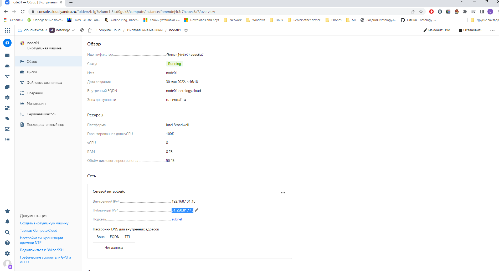
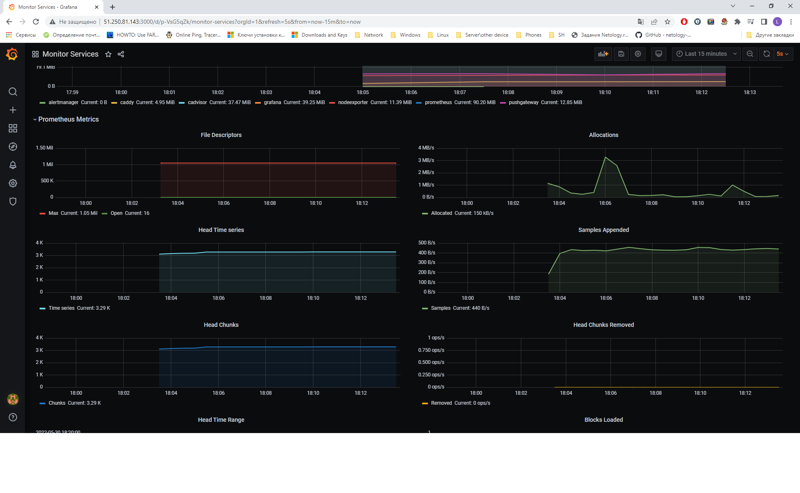

# Домашнее задание к занятию "5.4. Оркестрация группой Docker контейнеров на примере Docker Compose"


## Задача 1
В чём отличие режимов работы сервисов в Docker Swarm кластере: replication и global?
```
Когда указан mode global - сервис запустится на всех нодах, в случае с replication - только на нодах, которые указаны в конфиге.
```
Какой алгоритм выбора лидера используется в Docker Swarm кластере?
```
Алгоритм RAFT. Raft является алгоритмом распределённого консенсуса, который нужен, чтобы несколько участников могли совместно решить, произошло ли событие или нет.
```
Что такое Overlay Network?
```
Overlay Network -  распределенная сеть кластера, которая позволяет общаться контейнерам между собой на разных нодах.
```

## Задача 2



## Задача 3

