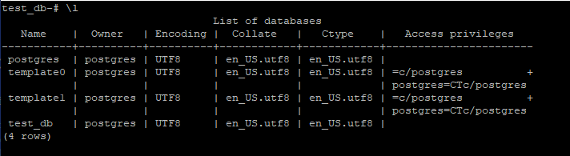
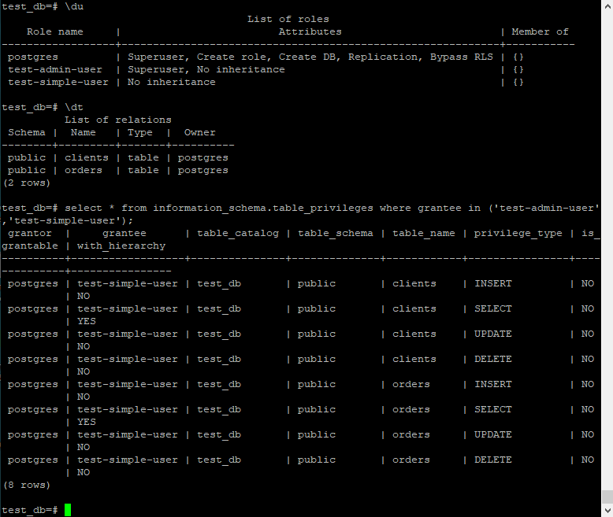
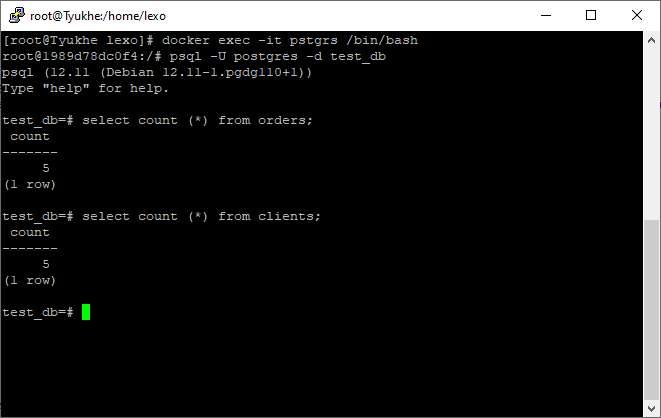
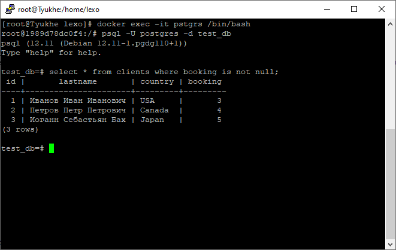
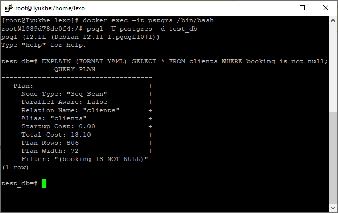

# Домашнее задание к занятию "6.2. SQL"

## Задача 1

$ docker pull postgres:12

$ docker volume create vol1
vol1

$ docker volume create vol2
vol2

$ docker run -d --rm --name pstgrs -e POSTGRES_PASSWORD=postgres -ti -p 5432:5432 -v vol1:/var/lib/postgresql/data -v vol2:/backup postgres:12

postgres=# \l

                                 List of databases
       Name    |  Owner   | Encoding |  Collate   |   Ctype    |   Access privileges
    -----------+----------+----------+------------+------------+-----------------------
     postgres  | postgres | UTF8     | en_US.utf8 | en_US.utf8 |
     template0 | postgres | UTF8     | en_US.utf8 | en_US.utf8 | =c/postgres          +
               |          |          |            |            | postgres=CTc/postgres
     template1 | postgres | UTF8     | en_US.utf8 | en_US.utf8 | =c/postgres          +
	           |          |          |            |            | postgres=CTc/postgres
    (3 rows)

## Задача 2

CREATE DATABASE test_db
CREATE ROLE "test-admin-user" SUPERUSER NOCREATEDB NOCREATEROLE NOINHERIT LOGIN;

CREATE TABLE orders 
(
id integer, 
name text, 
price integer, 
PRIMARY KEY (id) 
);

CREATE TABLE clients 
(
    id integer PRIMARY KEY,
    lastname text,
    country text,
    booking integer,
    FOREIGN KEY (booking) REFERENCES orders (Id)
);

CREATE ROLE "test-simple-user" NOSUPERUSER NOCREATEDB NOCREATEROLE NOINHERIT LOGIN;

GRANT SELECT ON TABLE public.clients TO "test-simple-user";

GRANT INSERT ON TABLE public.clients TO "test-simple-user";

GRANT UPDATE ON TABLE public.clients TO "test-simple-user";

GRANT DELETE ON TABLE public.clients TO "test-simple-user";

GRANT SELECT ON TABLE public.orders TO "test-simple-user";

GRANT INSERT ON TABLE public.orders TO "test-simple-user";

GRANT UPDATE ON TABLE public.orders TO "test-simple-user";

GRANT DELETE ON TABLE public.orders TO "test-simple-user";

Список баз данных:

Список таблиц и привелегий:

## Задача 3

insert into orders VALUES (1, 'Шоколад', 10), (2, 'Принтер', 3000), (3, 'Книга', 500), (4, 'Монитор', 7000), (5, 'Гитара', 4000);

insert into clients VALUES (1, 'Иванов Иван Иванович', 'USA'), (2, 'Петров Петр Петрович', 'Canada'), (3, 'Иоганн Себастьян Бах', 'Japan'), (4, 'Ронни Джеймс Дио', 'Russia'), (5, 'Ritchie Blackmore', 'Russia');

## Задача 4

update  clients set booking = 3 where id = 1;

update  clients set booking = 4 where id = 2;

update  clients set booking = 5 where id = 3;

## Задача 5

EXPLAIN - позволяет нам дать служебную информацию о запросе к БД, в том числе время на выполнение запроса, что при оптимизации работы БД является очень полезной информацией.

## Задача 6

Делаю бэкап базы 

~$ docker exec -t pstgrs pg_dump -U postgres test_db -f /backup/dump_test.sql

Поднимаю новый контейнер

~$ docker run -d --rm --name pstgrs2 -e POSTGRES_PASSWORD=postgres -ti  -p 5434:5434 -v vol3:/var/lib/postgresql/data -v vol2:/backup  postgres:12

Заливаю бэкап

~$ docker exec -i pstgrs2 psql -U postgres -d test_db -f /backup/dump_test.sql

Делаю одну выборку из предыдущего задания:

test_db=# select * from clients where booking is not null;

     id |       lastname       | country | booking
    ----+----------------------+---------+---------
      1 | Иванов Иван Иванович | USA     |       3
      2 | Петров Петр Петрович | Canada  |       4
      3 | Иоганн Себастьян Бах | Japan   |       5
