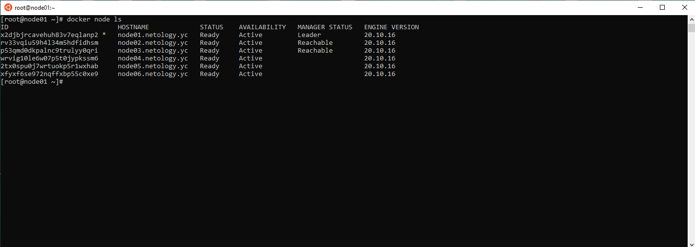
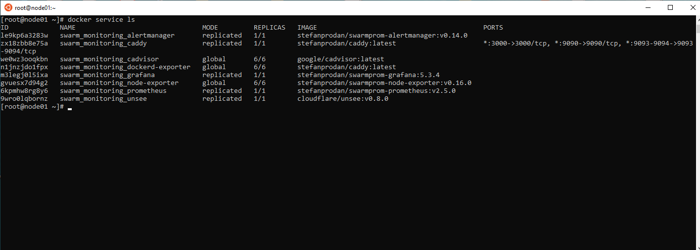

# Домашнее задание к занятию "08.01 Введение в Ansible."

## 1

## 2

## 3

## 5-6

## 7

    ansible-vault encrypt group_vars/deb/examp.yml && ansible-vault encrypt group_vars/el/examp.yml

## 8

    ansible-playbook -i inventory/prod.yml site.yml --ask-vault-pass

## 9

local

## 10

  local:
    hosts:
      localhost:
        ansible_connection: local

## 11

