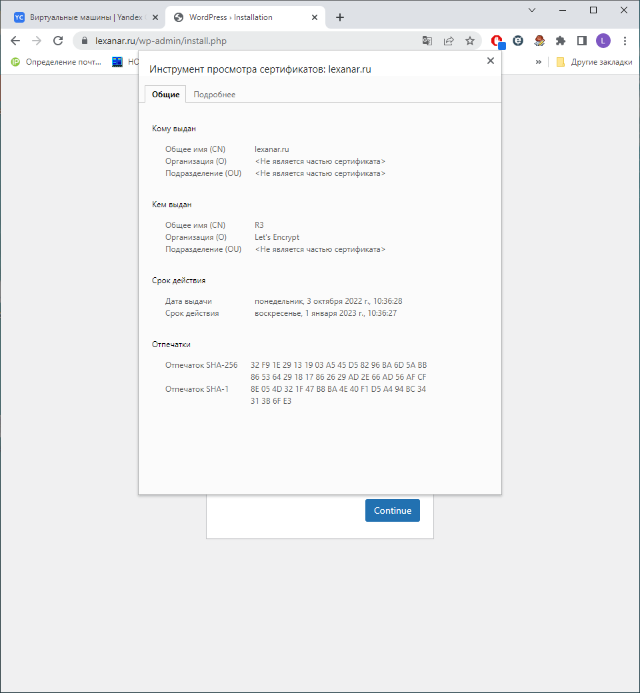
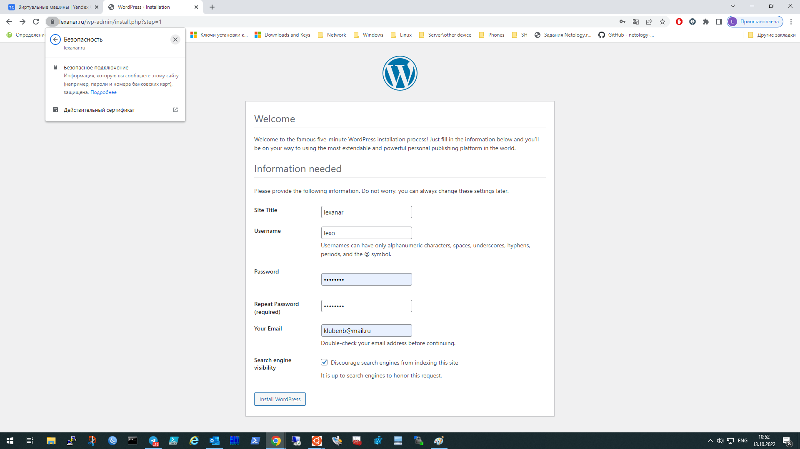
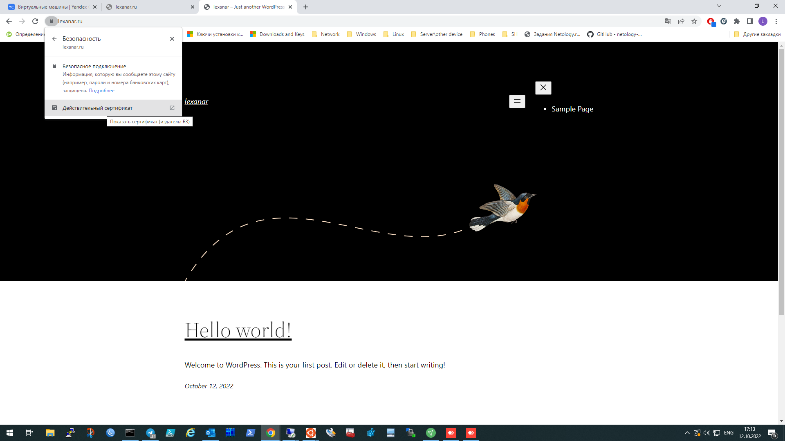
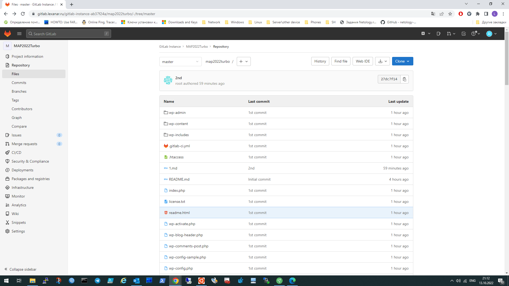
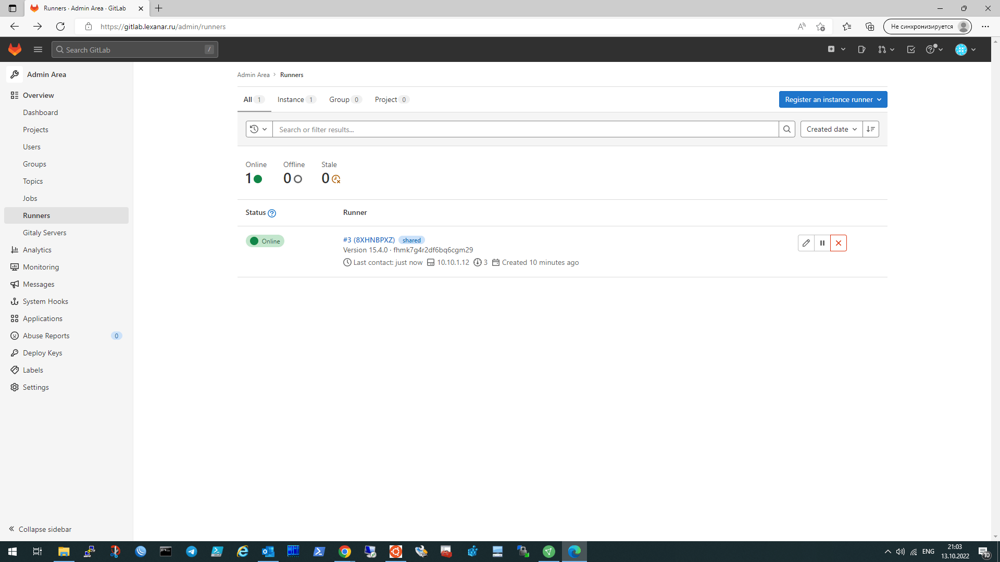
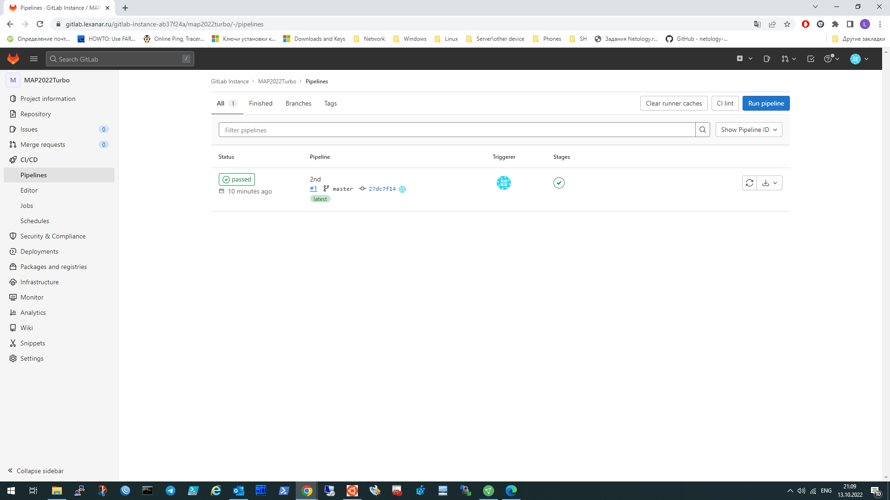
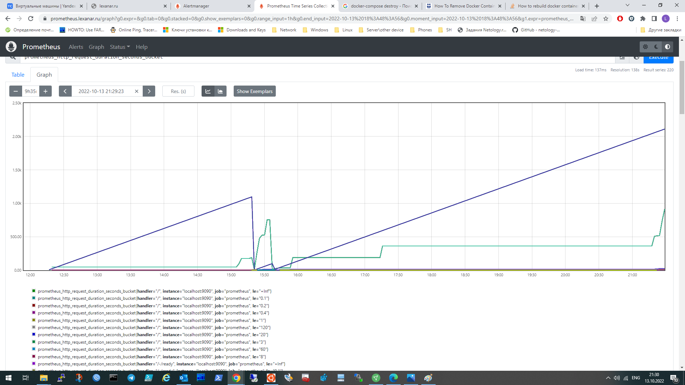
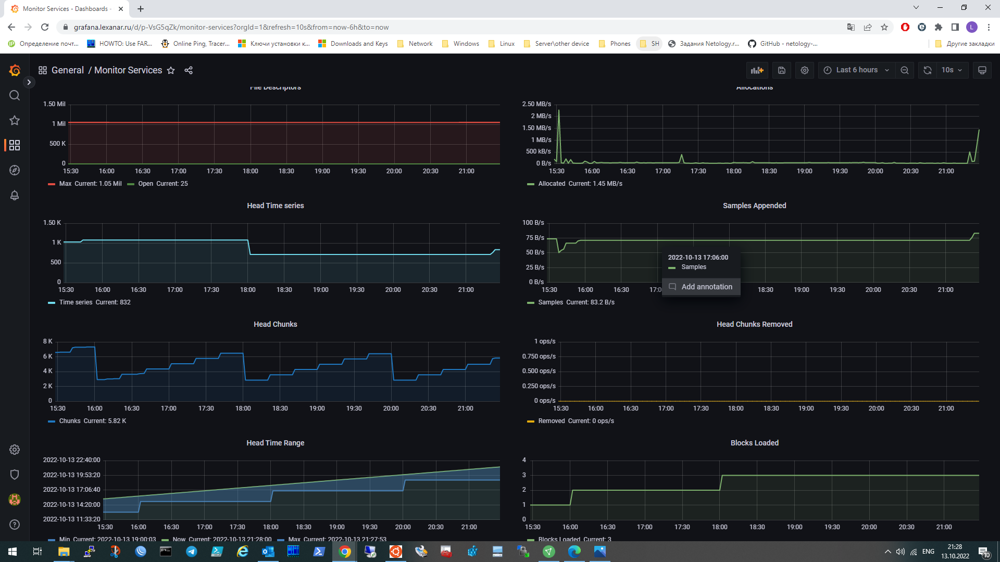
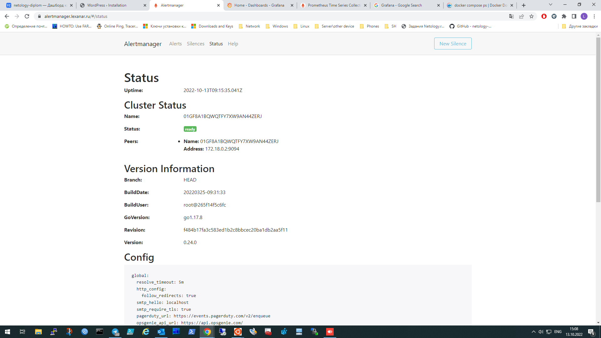

# Дипломный практикум в YandexCloud

## Цели:

1. Зарегистрировать доменное имя (любое на ваш выбор в любой доменной зоне).
2. Подготовить инфраструктуру с помощью Terraform на базе облачного провайдера YandexCloud.
3. Настроить внешний Reverse Proxy на основе Nginx и LetsEncrypt.
4. Настроить кластер MySQL.
5. Установить WordPress.
6. Развернуть Gitlab CE и Gitlab Runner.
7. Настроить CI/CD для автоматического развёртывания приложения.
8. Настроить мониторинг инфраструктуры с помощью стека: Prometheus, Alert Manager и Grafana.


#### 1.
Регистрирую домен lexanar.ru на nic.ru. Прописываю DNS-серверы YC.


#### 2.

В cилу ограниченности по ресурсам выбрал путь с одним workspace.

В Terraform Cloud создаю workspace:


Развёртывание инфраструктуры в YC будет осуществляться при помощи Terraform. Конфигурационные файлы доступны по [ссылке.](https://github.com/lexche/devops-netology/tree/master/diplom/terraform)

Вывод команды   `terraform init`:

``` Initializing Terraform Cloud...

Initializing provider plugins...
- Finding yandex-cloud/yandex versions matching "0.75.0"...
- Installing yandex-cloud/yandex v0.75.0...
- Installed yandex-cloud/yandex v0.75.0 (self-signed, key ID E40F590B50BB8E40)

Partner and community providers are signed by their developers.
If you'd like to know more about provider signing, you can read about it here:
https://www.terraform.io/docs/cli/plugins/signing.html

Terraform has created a lock file .terraform.lock.hcl to record the provider
selections it made above. Include this file in your version control repository
so that Terraform can guarantee to make the same selections by default when
you run "terraform init" in the future.

Terraform Cloud has been successfully initialized!

You may now begin working with Terraform Cloud. Try running "terraform plan" to
see any changes that are required for your infrastructure.

If you ever set or change modules or Terraform Settings, run "terraform init"
again to reinitialize your working directory.

terraform validate:
Success! The configuration is valid.     
```

Далее terraform apply --auto-approve. Проверяю создануую инфраструктуру в YC:


Успех.

#### 3-5.

Далее использую Ansible. Конфигурации ролей доступны по [ссылке.](https://github.com/lexche/devops-netology/tree/master/diplom/ansible)

Добавляю значения output-переменных Terraform в ~/.ssh/config .

Очищаю  файл known_hosts.

Добавляю IP-адреса серверов в variables.yml

Запускаю роли основного сервера, кластера БД и WordPress:
```
ansible-playbook entrance/task/main.yml

PLAY RECAP **********************************************************************************************************
lexanar.ru                 : ok=18   changed=16   unreachable=0    failed=0    skipped=0    rescued=0    ignored=0


ansible-playbook db/task/main.yml

PLAY RECAP **********************************************************************************************************
db01.lexanar.ru            : ok=17   changed=7    unreachable=0    failed=0    skipped=0    rescued=0    ignored=0
db02.lexanar.ru            : ok=12   changed=5    unreachable=0    failed=0    skipped=0    rescued=0    ignored=0

ansible-playbook app/task/main.yml

PLAY RECAP **********************************************************************************************************
app.lexanar.ru             : ok=18   changed=16   unreachable=0    failed=0    skipped=0    rescued=0    ignored=0

```

Проверяю сертификат:



Установка Wp:



Главная страница WP:




#### 6.

Запускаю роль GitLab\runner :
```
ansible-playbook gitlab/task/main.yml 

PLAY RECAP **********************************************************************************************************
gitlab.lexanar.ru   : ok=14   changed=14   unreachable=0    failed=0    skipped=0    rescued=0    ignored=0  

```

Создаю gitlab-runner по инструкции:

```
gitlab-runner register
....
```

В Wordpress-проекте создадю pipeline-файл .gitlab-ci.yml:
```

before_script:
  - eval $(ssh-agent -s)
  - echo "$ssh_key" | tr -d '\r' | ssh-add -
  - mkdir -p ~/.ssh
  - chmod 700 ~/.ssh

deploy-job:
  stage: deploy
  script:
    - echo "Deploy" 
    # Upload to server
    - rsync -vz -e "ssh -o StrictHostKeyChecking=no" ./* /var/www/wordpress/
    - ssh -o StrictHostKeyChecking=no rm -rf /var/www/wordpress/.git
    # Provide file permissions
   - ssh -o StrictHostKeyChecking=no sudo chown -R www-data /var/www/wordpress/ 
   
```    
Добавляю .git-репозиторий для Wordpress-проекта:

``` 
git init
git remote add origin http://gitlab.lexanar.ru/gitlab-instance-ab37f24a/wordpress.git
git add .
.....
``` 








#### 7.

Запускаю роль для установки Prometheus, Grafana, Alert Manager:

```
ansible-playbook monitoring/task/main.yml

PLAY RECAP **********************************************************************************************************
monitoring.lexanar.ru      : ok=13   changed=8    unreachable=0    failed=0    skipped=0    rescued=0    ignored=0

```
Prometheus:


Grafana:


Alertmanager:


