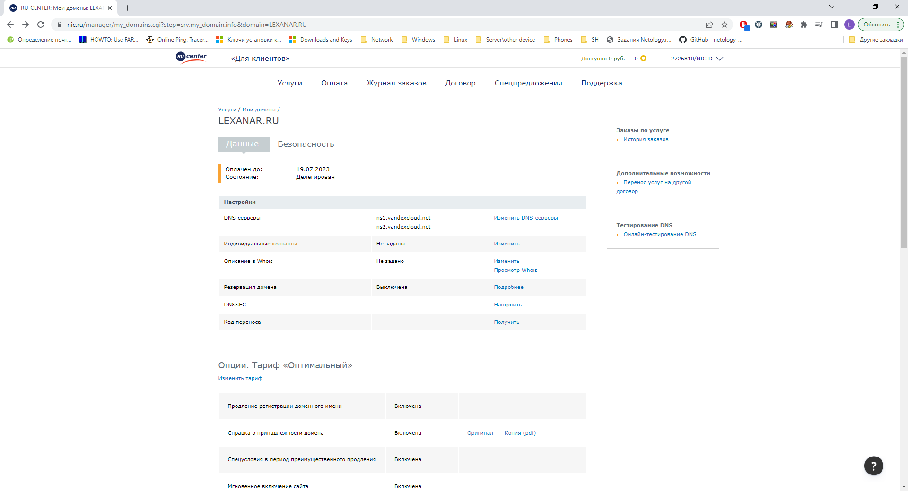
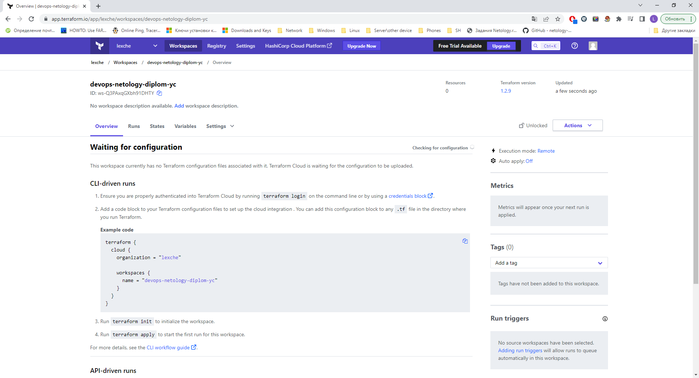

# Дипломный практикум в YandexCloud

## Цели:

1. Зарегистрировать доменное имя (любое на ваш выбор в любой доменной зоне).
2. Подготовить инфраструктуру с помощью Terraform на базе облачного провайдера YandexCloud.
3. Настроить внешний Reverse Proxy на основе Nginx и LetsEncrypt.
4. Настроить кластер MySQL.
5. Установить WordPress.
6. Развернуть Gitlab CE и Gitlab Runner.
7. Настроить CI/CD для автоматического развёртывания приложения.
8. Настроить мониторинг инфраструктуры с помощью стека: Prometheus, Alert Manager и Grafana.

#### 1.
Регистрирую домен lexanar.ru на nic.ru. Прописываю DNS-серверы YC.

#### 2.
В Terraform Cloud создаю workspace:

Развёртывание инфраструктуры в YC будет осуществляться при помощи Terraform. Конфигурационные файлы доступны по [ссылке](https://github.com/lexche/devops-netology/tree/master/diplom/terraform).
